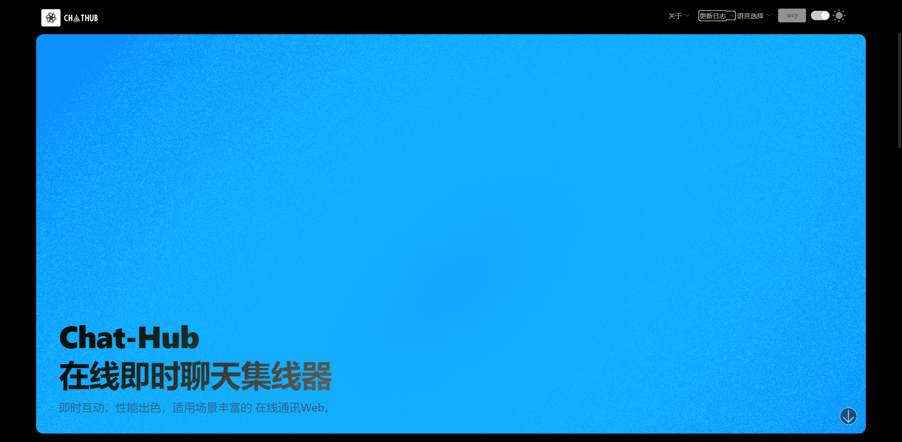

# ChatHubWeb(实时通信 Web 平台)  
  
[](https://github.com/Lingwcy/ChatHubWeb/blob/main/LICENSE) 


  
#### 目录
- ChatHubCore .NET8 Web Api 后端
- ChatHubVue 前台
- ChatHubAdminVue 后台[pure-admin]
- Mysql.sql 数据库结构

#### 如何运行  
  
1. 克隆仓库  
   ```bash  
   git clone https://github.com/Lingwcy/ChatHubWeb.git

2. 启动前端
   ```bash  
   cd ChatHubClient
   yarn 
   yarn dev


