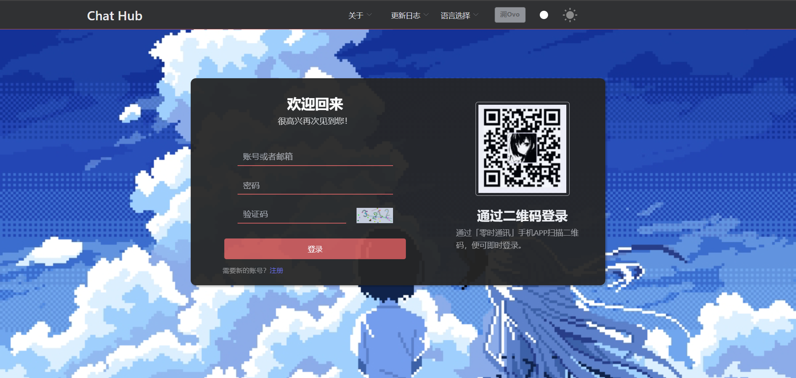

# ChatHubWeb(### 实时通信 Web 平台)  
我的毕设项目,目前还在开发
  
[](https://github.com/Lingwcy/ChatHubWeb/blob/main/LICENSE)  





以下内容AI生成 

#### 项目描述  
  
ChatHubWeb 是一个基于 Web 的实时通信客户端，专为与 ChatHub 实时通信服务器进行交互而设计。此项目使用现代前端技术栈构建，旨在为用户提供流畅、简洁、功能丰富的实时通信体验。  
  
#### 主要功能  
  
- 实时消息发送和接收  
- 用户注册和登录  
- 私人和公开聊天室  
- 文件传输功能  
- 用户状态管理和通知  
  
#### 技术栈  
  
- 前端框架：Vue.js  
- 状态管理：Pinia  
- 通信: SignalR(WebSocket), HTTP 
- UI 库：Element-UI
- 构建工具：Vite, Yarn
- 测试工具：Postman  
  

#### 目录
- ChatHubCore .NET8 Web Api 后端
- ChatHubVue 前台
- Mysql.sql 数据库结构

#### 如何运行  
  
1. 克隆仓库  
   ```bash  
   git clone https://github.com/Lingwcy/ChatHubWeb.git

2. 启动前端
   ```bash  
   cd ChatHubClient
   yarn 
   yarn dev


#### 许可证
本项目使用 MIT 许可证，您可以自由使用、修改和分发本项目，但请遵守许可证中的相关规定。

#### 开发进度
本项目目前仍在积极开发中，部分功能可能尚未完成或存在缺陷。我们会在项目完成前进行持续的更新和优化，确保最终交付一个稳定、高效且用户友好的实时通信客户端。